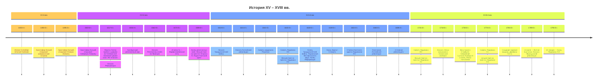

```mermaid
%%{init: { 'theme': 'base' } }%%
timeline
title История XV – XVIII вв.

section XV-й век
	1450-е г. : Иоганн Гутенберг печатает Библию
	1492-й г. : Христофор Колумб открывает американские острова
	1495-й г. : Христофор Колумб открывает Южную Америку
section XVI-й век
	1502-й г. : Христофор Колумб открывает Северную Америку
	1517-й г. : Мартин Лютер прибил к дверям виттенбергской Замковой церкви свои «95 тезисов» : Начало Реформации
	1555-й г. : Аугсбургский религиозный мир
	1562-й г. : Начало Религиозных войн во Франции
	1572-й г. : 24 августа — Варфоломеевская ночь
	1598-й г. : Конец религиозных войн. Восшествие на престол Генриха IV. Издан Нантский эдикт 
section XVII-й век
	1618-й г. : Начало Тридцатилетней войны
	1641-й г. : Начало Английской революции
	1642-й г. : Смерть кардинала Ришелье
	1643-й г. : Смерть Людовика XIII : Восшествие на престол Людовика XIV
	1648-й г. : Конец Тридцатилетней войны. Подписание Вестфальского мира. Конец Реформации
	1649-й г. : Казнь Карла I Стюарта
	1652-й г. : Отмена Нантского эдикта Людовиком XIV
	1660-й г. : Окончание Английской революции
	1688-й г. : «Славная революция»
section XVIII-й век
	1715-й г. : Смерть Людовика XIV : Восшествие на престол Людовика XV
	1718-й г. : Начало Эпохи юльпанов в Османской империи
	1730-й г. : Восстание в Стамбуле. Свержение Султана Ахмеда III и конец Эпохи тюльпанов
	1774-й г. : Смерть Людовика XV : восшествие на престол Людовика XVI
	1784-й г. : Создание паровой машины Джеймса Уатта
	1789-й г. : 14 июля — Взятие Бастилии. Начало Французской революции
	1793-й г. : 21 января — Казнь Людовика XVI
```